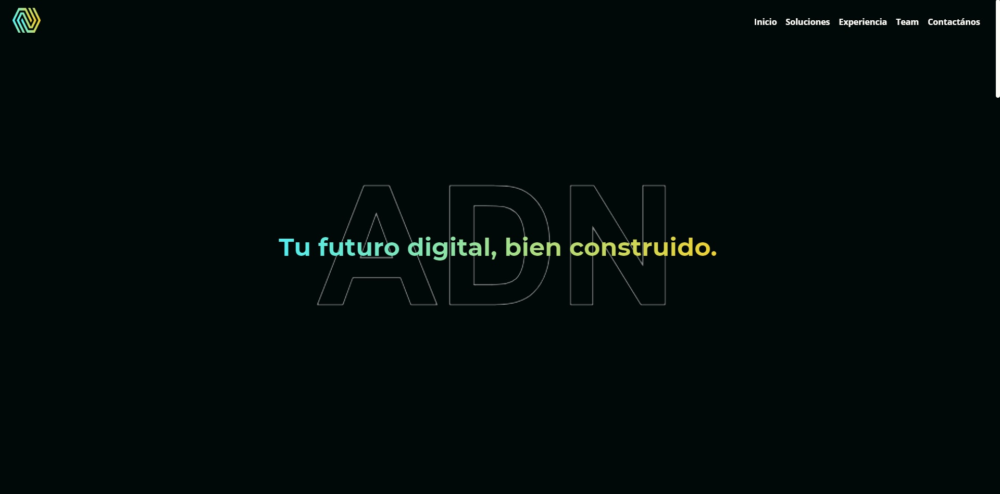
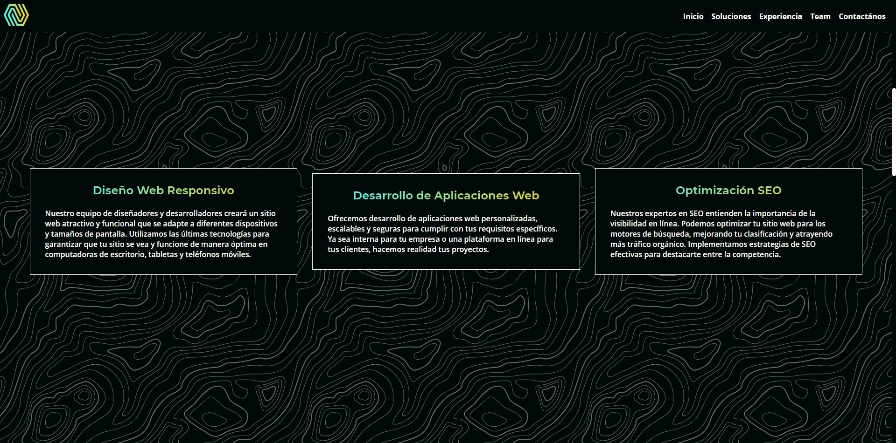
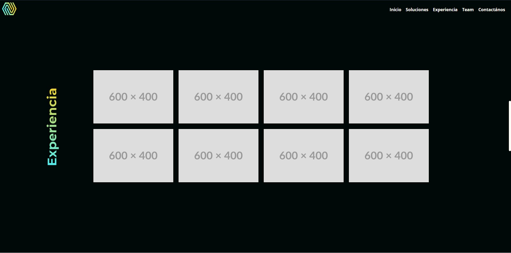
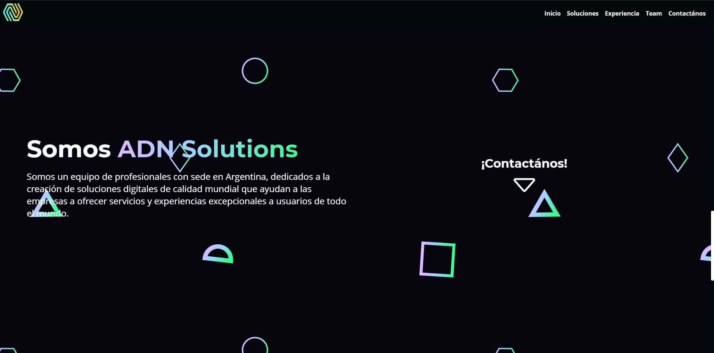

# ADN Solutions Mockup

["ADN Solutions"](https://tsuramii.github.io/ADN-Solutions-Mockup/) is a responsive page project developed for a Web Develoment Agency startup.
The goal of "ADN Solutions" was to create a modern and visually appealing page that would showcase the capabilities and expertise of the Web Development Agency. The project aimed to attract potential clients and provide them with information about the agency's services and past projects.

To achieve this, the development team utilized the latest web technologies and design trends. The page was built with a responsive layout, ensuring that it would adapt and function seamlessly across different devices and screen sizes. This approach was crucial in reaching a wider audience and delivering a consistent user experience.

The website featured a sleek and intuitive user interface, with a clean design that focused on presenting key information concisely. The color scheme and typography were carefully chosen to convey a sense of professionalism and modernity. Strategic use of visuals, including high-quality images and videos, helped to capture the attention of visitors and engage them with the content.

## Technologies used

* HTML
* CSS
* Javascript

### Installation

Go to the [live preview](https://tsuramii.github.io/ADN-Solutions-Mockup/)

or

Download the zip file of the project, unzip it and open index.html

then open index.html or run a live server with VSCode

## Features

**Responsive design:** The webpage is designed to adapt and function seamlessly across different devices and screen sizes, providing a consistent user experience.

**Clear navigation:** The webpage features an intuitive and easy-to-use navigation menu, allowing users to quickly find the desired sections or information.

**Engaging visuals:** High-quality designs are strategically placed throughout the page to capture visitors' attention and create visual interest.

## About

**Note:** All styling, logic, and code was done 100% by [me](https://www.linkedin.com/feed/) excluding the background patterns and the logo.

## Screenshots

***

***

***

***

## License

This project is licensed under the GNU GENERAL PUBLIC License - see the LICENSE.md for more details.
