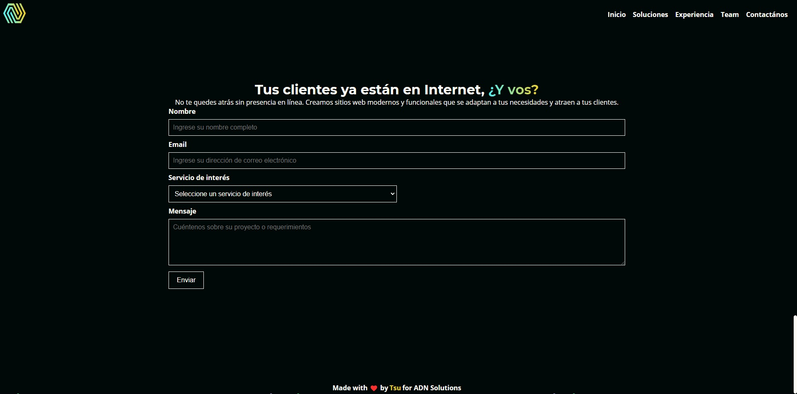

# ADN Solutions Mockup
⚠️ **Note**: This project won’t be updated further. It’s archived for reference.

["ADN Solutions"](https://tsu.is-a.dev/adn-solutions-mockup/) is a mockup I created for a Web Development Agency startup. The goal was to build a modern, responsive page that showcases the agency's services and past projects, making it attractive to potential clients.

This project uses the latest design trends with a clean and intuitive layout. It's fully responsive and works great on all devices!

## Technologies used
- HTML
- CSS
- JavaScript

### Installation

- Download and unzip the project, then open `index.html`, or
- Clone and run it with a live server in VSCode.

## Features
- **Responsive design**: Looks great on any device.
- **Easy navigation**: Simple and intuitive to use.
- **Engaging visuals**: Designed to capture attention.

## About
Everything (styling, logic, code) was done 100% by me, except the background patterns and logo.

## Screenshots

---

---

---

---

## License

This project is licensed under the GNU GENERAL PUBLIC License. See LICENSE.md for details.
